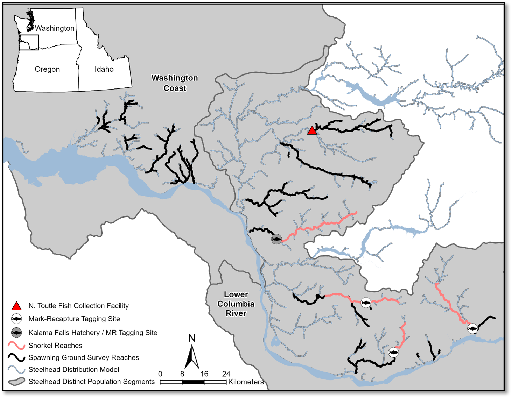

<script>
   $(document).ready(function() {
     $head = $('#header');
     $head.prepend('')
   });
</script>

***

<!-- ## Overview-->
<!-- This markdown documents the estimation of pHOS for Lower Columbia winter steelhead populations based on spawning ground surveys. It is only completed for populations below dams and excludes the Lower Cowlitz & NF Lewis for which estimates are developed as part of other reporting processes. Estimates for Kalama and NF Toutle/Mainstem Toutle Populations are incomplete here because a portion of these populations is located above dams so these estimates must be combined with the above dam estimates for those populations. Summer steelhead pHOS estimates are also excluded because those are available from snorkel surveys. Three models are used to estimate pHOS: 1) method of moments where pHOS is calculated as (HOS/(HOS + NOS)) annually for each population in years data are available, 2) a multivariate state-space model fit to the count data using a logit link function and a binomial response using STAN [**rstan**](https://mc-stan.org/users/interfaces/rstan), 3) a Generalize Additive Model fit to the count data using a logit link function and a binomial response where a thin plate spline is fit independently to each population's data using the R package [**mgcv**](https://cran.r-project.org/web/packages/mgcv/mgcv.pdf). The model used to fit the logit-normal random walk is printed below in the appendix. -->

```{r set_options, echo = FALSE, message = FALSE}
#options(width = 100)
#knitr::opts_chunk$set(message = FALSE)
set.seed(123)
```


<!-- We also need a couple of helper functions which we will define -->
```{r load_funcs, message = FALSE, warning = FALSE,results = "hide",echo=FALSE}
#function
select_table_PostgreSQL<-function(database_args,SQL){
  con <- DBI::dbConnect(
    odbc::odbc(),
    Driver = database_args$Driver,
    Server = database_args$Server,
    Database = database_args$Database,
    Port = database_args$Port,
    UID = database_args$UID,
    PWD = database_args$PWD,
    Trusted_Connection = database_args$Trusted_Connection
  )
  dat<- data.frame(DBI::dbGetQuery(con, SQL))
  DBI::dbDisconnect(con)
  return(dat)
}

#function to add prediction to model output
add_predictions <- function (data, model, var = "pred", ...) {
     fit <- as_tibble(stats::predict(model, data, ...))
     names(fit)[1] <- var  
     bind_cols(data, fit)
}

#function to install or load packages
install_or_load_pack <- function(pack){
  create.pkg <- pack[!(pack %in% installed.packages()[, "Package"])]
  if (length(create.pkg))
    install.packages(create.pkg, dependencies = TRUE,repos = "http://cran.us.r-project.org")
  sapply(pack, require, character.only = TRUE)
}

#function for inverse logit transform.
ilogit<-function(x){exp(x)/(1+exp(x))}
```

<!-- Here we will load & install packages we need to use (needs internet connection if packages not already installed) -->
```{r load_packages, message = FALSE, warning = FALSE,results = "hide", echo=FALSE}
packages_list<-c("dataRetrieval"
                 ,"RSocrata"
                 ,"httr"
                 ,"jsonlite"
                 ,"scales"
                 ,"RColorBrewer"
                 ,'viridis'
                 ,'ggsci'
                 ,'tidyverse'
                 ,"mgcv"
                 ,"modelr"
                 ,"brms"
                 ,"rstan"
                 ,"reshape2"
                 ,"DBI"
                 ,"flextable"
                 ,"janitor"
                 )
install_or_load_pack(pack = packages_list)

```

<!-- ## User inputs -->
```{r user inputs, message = FALSE, warning = FALSE,results = "hide",echo=FALSE}
include_holders = T
Y <- 2024
```


<!-- ## Get Raw Data -->
<!-- In this section, data used in the analysis is loaded and prepared for analysis -->
```{r get_data, message=FALSE, warning=FALSE, results="show", echo=FALSE}

database_args<-list(
  Driver = "PostgreSQL Unicode",
  Server = Sys.getenv("POSTGRES_TWS_IP"),
  Database = "FISH",
  Port = 5432,
  UID = Sys.getenv("POSTGRES_TWS_UN"),
  PWD = Sys.getenv("POSTGRES_TWS_PW"),
  Trusted_Connection = "True"
)

SQL1 <- c(
"SELECT 
  tws.HEADER.Survey_Date AS Date,
  tws.GEAR_LUT.gear,
  tws.SGS_REACHES_LUT.thomas_subpopulation AS Population,
  tws.sgs_reaches_lut.stream_name AS Stream,
  tws.sgs_reaches_lut.stream_reach_code AS Stream_Reach,
  tws.SGS_REACHES_LUT.upper_river_mile_meas AS Upper_RM,
  tws.SGS_REACHES_LUT.lower_river_mile_meas AS Lower_RM,
  splut.species AS species,
  runlut.run_desc AS Run,
  mlut.markcode AS Mark,
  'Live' AS Live_Carc,
  dclut.categorycode AS Live_Type,
  Sum(tws.DATASHEET_STREAM_SURVEY.Count_Num) AS Count 
FROM 
  tws.SGS_REACHES_LUT INNER JOIN (tws.HEADER INNER JOIN tws.DATASHEET_STREAM_SURVEY ON tws.HEADER.HEADER_Id = tws.DATASHEET_STREAM_SURVEY.HEADER_Id) ON tws.SGS_REACHES_LUT.stream_reach_id = tws.HEADER.STREAM_REACH_Id
  JOIN tws.species_lut splut ON tws.DATASHEET_STREAM_SURVEY.SPECIES_Id = splut.species_lut_id
  JOIN tws.run_lut runlut ON tws.DATASHEET_STREAM_SURVEY.RUN_LUT_Id = runlut.run_lut_id
  JOIN tws.mark_type_lut mlut ON tws.DATASHEET_STREAM_SURVEY.MARK_TYPE_LUT_Id = mlut.mark_type_id
  JOIN tws.datasheet_category_lut dclut ON tws.DATASHEET_STREAM_SURVEY.DatasheetCategory = dclut.datasheet_category_id
  JOIN tws.GEAR_LUT ON tws.HEADER.GEAR_TYPE_LUT_Id = tws.GEAR_LUT.gear_lut_id
GROUP BY 
  tws.HEADER.Survey_Date,
  tws.GEAR_LUT.gear,
  tws.SGS_REACHES_LUT.thomas_subpopulation, 
  tws.sgs_reaches_lut.stream_name, 
  tws.sgs_reaches_lut.stream_reach_code, 
  tws.SGS_REACHES_LUT.upper_river_mile_meas,
  tws.SGS_REACHES_LUT.lower_river_mile_meas, 
  splut.species,
  runlut.run_desc,
  mlut.markcode,
  Live_Carc, 
  dclut.categorycode
HAVING (((splut.species)='Steelhead'));"
)

dat1<-select_table_PostgreSQL(database_args=database_args,SQL=SQL1)%>%
     as_tibble()

SQL2 <- c(
"SELECT
  tws.HEADER.Survey_Date AS Date,
  tws.GEAR_LUT.gear,
  tws.SGS_REACHES_LUT.thomas_subpopulation AS Population,
  tws.SGS_REACHES_LUT.stream_name AS Stream,
  tws.sgs_reaches_lut.stream_reach_code AS Stream_Reach,
  tws.SGS_REACHES_LUT.upper_river_mile_meas AS Upper_RM,
  tws.SGS_REACHES_LUT.lower_river_mile_meas AS Lower_RM,
  splut.species AS species,
  runlut.run_desc AS Run,
  mlut.markcode AS Mark,
  'Carc' AS Live_Carc, 
  '' AS Live_Type,
  COUNT(tws.SCALECARD_FRONT.SCALE_CARD_FRONT_Id) AS Count
FROM ((tws.SGS_REACHES_LUT INNER JOIN tws.HEADER ON tws.SGS_REACHES_LUT.stream_reach_id =      
  tws.HEADER.STREAM_REACH_Id) INNER JOIN tws.SCALECARD_BACK ON tws.HEADER.HEADER_Id = tws.SCALECARD_BACK.HEADER_Id) 
  INNER JOIN tws.SCALECARD_FRONT ON tws.SCALECARD_BACK.SCALE_CARD_Id = tws.SCALECARD_FRONT.SCALE_CARD_Id
  JOIN tws.species_lut splut ON tws.SCALECARD_BACK.SPECIES_Id = splut.species_lut_id
  JOIN tws.run_lut runlut ON tws.SCALECARD_BACK.RUN_LUT_Id = runlut.run_lut_id
  JOIN tws.mark_type_lut mlut ON tws.SCALECARD_FRONT.MARK_TYPE_LUT_Id = mlut.mark_type_id
  JOIN tws.GEAR_LUT ON tws.HEADER.GEAR_TYPE_LUT_Id = tws.GEAR_LUT.gear_lut_id
GROUP BY 
  tws.HEADER.Survey_Date,
  tws.GEAR_LUT.gear,
  tws.SGS_REACHES_LUT.thomas_subpopulation,
  tws.SGS_REACHES_LUT.stream_name,
  tws.sgs_reaches_lut.stream_reach_code, 
  tws.SGS_REACHES_LUT.upper_river_mile_meas,
  tws.SGS_REACHES_LUT.lower_river_mile_meas,
  splut.species,
  runlut.run_desc,
  mlut.markcode,
  Live_Carc,
  Live_Type,
  tws.HEADER.GEAR_TYPE_LUT_Id
HAVING ((splut.species='Steelhead') AND ((tws.gear_lut.gear)='Stream Survey' Or   
  (tws.gear_lut.gear)='IMW'));"
)


DF<-select_table_PostgreSQL(database_args=database_args,SQL=SQL2)%>%
     as_tibble()%>%
     bind_rows(dat1)%>%
     mutate(live_type=ifelse(live_type=="",NA,live_type),
            gear = ifelse(gear=="IMW","Stream Survey",gear)
            )


if(include_holders == F){
  DF<-DF%>%
       dplyr::filter(is.na(live_type) | live_type !="Holder") #can exclude holders (because could include live fish prior to harvest or recruitment to hatchery)...that said doesn't seem to change results 
  holders <-"no_holders"
}else{
  holders <-"with_holders"   
}  
DF<-DF%>%
  dplyr::filter(mark%in%c("LV","AD+LV","AD+RV","UM","AD"))%>%
  mutate(mark = ifelse(mark %in% c("AD","LV","AD+LV","AD+RV"),"HOS","NOS"))%>%
  dplyr::filter(population!="Cedar",
               population!="Delameter_Above Weir",
               population!="Salmon Creek",
               population!="White Salmon",
               population!="Olequa_Above Weir",
               population!="Ostrander_Above Weir",
               population!="Mainstem Columbia",
               population!="Lower Cowlitz",
               population!="")%>%
  mutate(population = str_replace(population, "Kalama","Kalama_below_KFH"),
        population = str_replace(population, "Green","NF_Toutle_Green_only")
  )%>%
  dplyr::mutate(date=ymd(date),
               year=year(date),
               month= month(date),
               spawn_year= ifelse(month < 12, year, year + 1)
  )%>%
  dplyr::filter(month >11 | month <7)%>% #exclude data from 6/30 -12/1 each year
  dplyr::filter(spawn_year!=Y+1)%>% #not a complete year yet
  dplyr::group_by(spawn_year,population,mark,gear)%>%
  dplyr::summarise(count = sum(count))%>%
  pivot_wider(names_from = mark, values_from = count,values_fill = 0)%>%
  dplyr::mutate(pHOS_mom = HOS/(HOS+NOS),population=factor(population))%>% # calculate a "method of moments" estimate
  mutate(population = paste0(population," ","winter"))

```

```{r get summer steelhead pHOS raw data,  message=FALSE, warning=FALSE, results="show", echo=FALSE}

SQLstring<- c(
"SELECT
  tws.header.header_id,
  tws.GEAR_LUT.gear,
  tws.header.survey_date,
  tws.header.return_yr,
  tws.header.gear_type_lut_id,
  tws.stream_name_lut.stream_name,
  tws.header.stream_reach_id,
  tws.species_lut.species,
  tws.datasheet_trap.mark_type_lut_id,
  tws.mark_type_lut.markcode,
  tag_type1.tag_type ,
  tag_color1.description,
  tag_type2.tag_type ,
  tag_color2.description,
  tws.datasheet_trap.count_num,
  tws.run_lut.run_desc
FROM
  (
    (
      tws.stream_name_lut
      LEFT JOIN (
        tws.header
        INNER JOIN tws.datasheet_trap ON tws.header.header_id = tws.datasheet_trap.header_id
      ) ON tws.stream_name_lut.stream_lut_id = tws.header.stream_lut_id
    )
    LEFT JOIN tws.species_lut ON tws.datasheet_trap.species_id = tws.species_lut.species_lut_id
  )
  LEFT JOIN tws.mark_type_lut ON tws.datasheet_trap.mark_type_lut_id = tws.mark_type_lut.mark_type_id
  LEFT JOIN tws.run_lut ON tws.datasheet_trap.run_lut_id = tws.run_lut.run_lut_id
  LEFT JOIN tws.tag_type_lut AS tag_type1 ON tws.datasheet_trap.recapture_tag_1_type_lut_id = tag_type1.tag_type_lut_id
  LEFT JOIN tws.tag_shape_color_lut AS tag_color1 ON tws.datasheet_trap.recapture_tag_1_shape_color_type_lut_id = tag_color1.tag_shape_color_lut_id
  LEFT JOIN tws.tag_type_lut AS tag_type2 ON tws.datasheet_trap.recapture_tag_2_type_lut_id = tag_type2.tag_type_lut_id 
  LEFT JOIN tws.tag_shape_color_lut AS tag_color2 ON tws.datasheet_trap.recapture_tag_2_shape_color_type_lut_id = tag_color2.tag_shape_color_lut_id
  JOIN tws.GEAR_LUT ON tws.HEADER.GEAR_TYPE_LUT_Id = tws.GEAR_LUT.gear_lut_id
WHERE
  (
    ((tws.GEAR_LUT.gear) = 'Snorkel Survey')
    AND ((tws.species_lut.species) = 'Steelhead')
    AND ((tws.run_lut.run_desc) = 'Summer')
  )
  OR (
    ((tws.GEAR_LUT.gear) = 'Snorkel Survey')
    AND ((tws.species_lut.species) = 'Steelhead')
    AND ((tws.run_lut.run_desc) = 'Summer')
  );"
)

DF<-DF%>%
  bind_rows(
    select_table_PostgreSQL(database_args=database_args,SQL=SQLstring)%>%
    as_tibble()%>%
    filter(stream_name %in%c("Washougal River","Lewis River - East Fork","Kalama River", "Wind River"))%>% 
    mutate(population=paste0(stream_name," ",str_to_lower(run_desc)))%>%
    mutate(spawn_year=ifelse(month(survey_date)>4,year(survey_date)+1,year(survey_date)))%>%
    group_by(population,spawn_year,markcode,gear)%>%
    summarise(count_num=sum(count_num))%>%
    filter(markcode%in%c("UM","AD"))%>%
    dplyr::filter(spawn_year!=Y+1)%>%
    mutate(markcode = ifelse(markcode=="AD","HOS","NOS"))%>%
    pivot_wider(id_cols=c("spawn_year","population"),names_from = markcode,values_from = count_num)%>%
    mutate(HOS=as.integer(ifelse(is.na(HOS),0,HOS)),
           NOS=as.integer(ifelse(is.na(NOS),0,NOS)
                          )
    )%>%
    mutate(pHOS_mom = (HOS/(HOS+NOS)))
  )%>%
  arrange(population,spawn_year)%>%
  ungroup()%>%
  mutate(
    population=str_remove_all(population, "[[:punct:]]"),
    pop_ind=as.numeric(as.factor(population))
    )
```

<!-- ## Analysis & Results -->
<!-- In this section we estimate annual pHOS by population with the clip status data using Generalized Additive Models and then present the results in graphical and tabular form. -->
```{r Analysis_v1, message=FALSE, warning=FALSE, results="show", echo=FALSE}

stan_dat<-list(
     T = length(min(DF$spawn_year):max(DF$spawn_year)),
     T_forward = 0,
     T_backward = 0,
     P = length(unique(DF$population)),
     n = dim(DF)[1],
     HOS_obs = as.integer(DF$HOS),
     NOS_obs = as.integer(DF$NOS),
     pop_obs = DF$pop_ind,
     year_obs = DF$spawn_year-min(DF$spawn_year) + 1
)
if(!file.exists(here::here("code/stan_model.rds"))){
     model<-stan_model(here::here("code/binomial_ss_random_walk_model_mv.stan"))
     saveRDS(model,here::here("code/stan_model.rds"))
}else{
     model<-readRDS(here::here("code/stan_model.rds"))
}
if(!file.exists(here::here(paste0("results/stan_fit_",holders,".rds")))){
m1_stan<-sampling(
     object = model,
     data = stan_dat,
     chains = 4,
     cores = 4,
     iter = 2000,
     warmup = 1000,
     thin = 1
)
saveRDS(m1_stan,here::here(paste0("results/stan_fit_",holders,".rds")))
}else{
     m1_stan<-readRDS(here::here(paste0("results/stan_fit_",holders,".rds")))
}


results<-extract(m1_stan)
DF<-data.frame(reshape2::melt(results$p_all))%>%
  as_tibble()%>%
  dplyr::rename(spawn_year = Var2,
           pop_ind = Var3
           )%>%
  mutate(spawn_year = spawn_year + min(DF$spawn_year) - 1)%>%
  left_join(DF%>%
             group_by(population)%>%
             summarise(population = first(population), pop_ind = first(pop_ind))
           )%>%
  dplyr::select(-pop_ind)%>%
  group_by(population,spawn_year)%>%
  summarise(value = quantile(value, c(0.025,0.5,0.975)), q = c(0.025, 0.5,0.975))%>%
  pivot_wider(names_from = q,values_from = value)%>%
  dplyr::rename(pHOS_ss_rw = `0.5`,
               pHOS_ss_rw_lower = `0.025`,
               pHOS_ss_rw_upper = `0.975`
               )%>%
  left_join(DF%>%dplyr::select(-pop_ind),by=c("spawn_year","population"))%>%
  ungroup()%>%
  arrange(population, spawn_year)
  
```

```{r Analysis_v2, message=FALSE, warning=FALSE, results="show", echo=FALSE}

m1<-gam(cbind(as.integer(HOS),as.integer(NOS)) ~ s(spawn_year,by=factor(population),bs="bs",m=1,k=-1), family = "binomial",data=DF)

DF<-expand.grid("population" = unique(DF$population),
                    "spawn_year" = unique(DF$spawn_year)
                    )%>%
     as_tibble()%>%
     add_predictions(m1,type="link", var ="pHOS_gam",se.fit=T)%>%
     mutate(pHOS_gam_lower = ilogit(pHOS_gam - 1.96 * se.fit),
            pHOS_gam_upper =ilogit(pHOS_gam + 1.96 * se.fit),
            pHOS_gam=ilogit(pHOS_gam)
            )%>%
     left_join(DF,by=c("spawn_year","population"))%>%
     ungroup()%>%
     arrange(population, spawn_year)
```

```{r abundance weighted avg, message=FALSE, warning=FALSE, results="show", echo=FALSE}

SPIdat <- read.socrata(
 "https://data.wa.gov/resource/x25s-cxg8.json",
 app_token = Sys.getenv("SPI_TOKEN"),
 email     = Sys.getenv("SPI_UN"),
 password  = Sys.getenv("SPI_PW")) %>%
 filter(commonpopname %in% c("Kalama Winter Steelhead","North Fork Toutle Winter Steelhead"))


lowertoutlemissing <- read.csv("NFToutle_missingdata.csv")

lowertoutleprop <- SPIdat %>%
  filter(popfitnotes=="Green River redd count expansion on MS and Tributary indexes" |
         popfitnotes=="Green River Tributary index only - not a total population estimate" |
         popfitnotes=="Total Escapement Estimate MS and Trib Surveys and NFT FCF Trap Counts" |
         popfitnotes=="Expanded Trib and MS Green R Escapement and NFT FCF Trap Counts") %>%
  mutate(subpop=ifelse(grepl("Green River",popfitnotes),"NF_Toutle_Green_only","NF_Toutle_Total"),
         commonpopname="NF Toutle (winter)") %>%
  dplyr::select(spawningyear,commonpopname,subpop,tsaej) %>%
  na.omit() %>%
  rbind(lowertoutlemissing) %>%
  pivot_wider(names_from = subpop,values_from = tsaej) %>%
  mutate(`Prop in Green R.` = round(as.numeric(NF_Toutle_Green_only)/as.numeric(NF_Toutle_Total), digits=3),
         spawningyear = as.double(spawningyear)) %>%
  arrange(spawningyear) %>%
  rename(`Spawn Year`=spawningyear,
         `Green R. Only`=NF_Toutle_Green_only,
         `NF Toutle Total`=NF_Toutle_Total)


NF_Toutle_winter_total <- lowertoutleprop %>%
  dplyr::select(spawn_year = `Spawn Year`, `Prop in Green R.`) %>%
  mutate(population = "NFToutleGreenonly winter") %>%
  left_join(DF) %>%
  mutate(across(c("pHOS_gam",
                  "pHOS_gam_lower",
                  "pHOS_gam_upper",
                  "pHOS_ss_rw_lower",
                  "pHOS_ss_rw",
                  "pHOS_ss_rw_upper",
                  "pHOS_mom"
                  ), ~ . * `Prop in Green R.`
  ))%>%
  mutate(HOS=NA,NOS=NA,gear="spawning ground survey and trap",se.fit=NA)%>%
  dplyr::select(-`Prop in Green R.`)%>%
  mutate(population="NF_Toutle winter")


upperkalamamissing <- read.csv("Kalama_missingdata.csv")

upperkalamaprop <- SPIdat %>%
  filter(commonpopname=="Kalama Winter Steelhead") %>%
  mutate(subpop="Kalama_winter_total",
         commonpopname="Kalama (winter)") %>%
  dplyr::select(spawningyear,commonpopname,subpop,tsaej) %>%
  rbind(upperkalamamissing) %>%
  na.omit() %>%
  pivot_wider(names_from = subpop,values_from = tsaej) %>%
  mutate(`Prop Above KFH` = round(as.numeric(Kalama_above_KFH)/as.numeric(Kalama_winter_total), digits=3),
         spawningyear = as.double(spawningyear)) %>%
  arrange(spawningyear) %>%
  rename(`Spawn Year`=spawningyear,
         `Kalama R. Above KFH`=Kalama_above_KFH,
         `Kalama R. Total`=Kalama_winter_total) %>%
  select(`Spawn Year`,commonpopname,`Kalama R. Above KFH`,`Kalama R. Total`,`Prop Above KFH`)


Kalama_winter_total <- upperkalamaprop %>%
  dplyr::select(spawn_year = `Spawn Year`, `Prop Above KFH`) %>%
  mutate(population = "KalamabelowKFH winter") %>%
  left_join(DF) %>%
  mutate(across(c("pHOS_gam",
                  "pHOS_gam_lower",
                  "pHOS_gam_upper",
                  "pHOS_ss_rw_lower",
                  "pHOS_ss_rw",
                  "pHOS_ss_rw_upper",
                  "pHOS_mom"
                  ), ~ . * (1-`Prop Above KFH`)
  ))%>%
  mutate(HOS=NA,NOS=NA,gear="spawning ground survey and trap",se.fit=NA)%>%
  dplyr::select(-`Prop Above KFH`)%>%
  mutate(population="Kalama winter")


DF<-DF%>%
  filter(spawn_year!=Y+1) %>%
  bind_rows(NF_Toutle_winter_total)%>%
  bind_rows(Kalama_winter_total)

```

## Executive Summary

Hatchery steelhead provide valuable angling opportunities and can be used to supplement natural-origin populations but may also pose risks to natural-origin populations. As a result, the proportion of hatchery-origin spawners (pHOS) is often monitored as a measure of genetic and ecological interactions between hatchery-origin and natural-origin steelhead. We used observations of hatchery- and natural-origin spawners during spawning ground surveys (winter steelhead) and snorkel surveys (summer steelhead) to develop estimates of pHOS for steelhead populations in the Washington State portion of the lower Columbia River. Three models were used to estimate pHOS: 1) a multivariate state-space model fit to the count data using a logit link function and a binomial response using STAN [**rstan**](https://mc-stan.org/users/interfaces/rstan), 2) a Generalized Additive Model fit to the count data using a logit link function and a binomial response where a thin plate spline is fit independently to each population’s data using the R package [**mgcv**](https://cran.r-project.org/web/packages/mgcv/mgcv.pdf), and 3) method of moment estimates where pHOS is calculated annually using the count data from each watershed for each population in years data are available. Results from each method were compared to determine the most appropriate estimates to report. The multivariate state-space model produced the most robust estimates. The five-year mean pHOS (spawn years `r Y-4`--`r Y`) was within Mitchell Act Biological Opinion (MA BiOp) standards for all populations except for Washougal Winter Steelhead and pHOS was unknown for Salmon Creek Winter Steelhead. Estimates for Kalama and NF Toutle winter run populations are reported both for below-dam subpopulations as well as the whole populations. Results currently exclude populations within the Cowlitz and Lewis basins for which estimates are developed as part of other reporting processes associated with dam operator licenses. Our results suggest that actions to reduce pHOS (gene banks, reductions in hatchery plants, changes in release locations of hatchery plants, and changes to recycling protocols) appear to have largely achieved pHOS targets identified in the MA BiOp.

\newpage

## Introduction

Pacific Salmon and steelhead (*Oncorhynchus spp.*) play a significant role in providing recreational and commercial opportunities across the Pacific Rim (Mahnken et al. 1998), supporting indigenous cultures (Garibaldi and Turner 2004; Noble et al. 2016) and contributing to the economic well-being of rural communities. As wild populations have declined in abundance, hatchery-produced salmon and steelhead have become essential for sustaining harvestable fisheries in many areas (Mahnken et al. 1998; Naish et al. 2007).

One of the earliest and largest efforts to enhance recreational and commercial fisheries using hatchery-produced salmon and steelhead took place in the Columbia River. Hatchery production in the lower Columbia River (LCR) began with Chinook Salmon (*Oncorhynchus tshawytcha*) on the Clackamas River in 1876 (Myers et al. 2006). The 1938 Mitchell Act, passed by the U.S. Congress to mitigate declines in Columbia River salmon and steelhead populations due to habitat loss, triggered a significant expansion of hatchery production (NOAA 2016). This led to the establishment of new hatchery facilities and increased production of salmon and steelhead throughout the region by the mid-20th century (Mahnken et al. 1998).

In recent decades, extensive research has focused on hatchery-produced salmon and steelhead (i.e., fish hatched and reared until ocean-ready juvenile migrant stage in captivity, hereafter “hatchery-origin”) and their interactions with naturally-produced salmon and steelhead (i.e., fish born in the natural environment, hereafter “natural-origin”). These studies have identified both the benefits generated by hatcheries and the conservation risks posed to natural-origin populations (Naish et al. 2007). Several studies have identified that hatchery spawners reduced fitness when reproducing in natural environments compared to their natural-origin counterparts (Araki et al. 2008; Chilcote et al. 2011; Christie et al. 2014) and interbreeding between hatchery- and natural-origin spawners can reduce the overall fitness of a population (Ford 2002). Concerns over the conservation status of natural-origin populations and the risks associated with hatcheries have led to a shift in policy focus, aiming to balance fishery augmentation benefits with negative conservation consequences.

The Washington Department of Fish and Wildlife initiated measures in the early 2000s to minimize interactions between hatchery- and natural-origin salmon and steelhead. The Statewide Steelhead Management Plan, approved by the Washington Fish and Wildlife Commission in 2008, outlined various policies, strategies, and actions (WDFW 2008), including the implementation of steelhead gene banks (i.e., rivers where no hatchery releases occur and wild steelhead populations are largely protected from the effects of hatchery programs) as a recovery strategy. Multiple gene banks were established in the lower Columbia River region by the mid-2010s, including those in the Grays, North Fork Toutle/Green, East Fork Lewis, and Wind rivers. Subsequently, with the release of the Mitchell Act Biological Opinion (MA BiOp) in 2017, additional measures were implemented to reduce hatchery- and natural-origin interactions. These measures included discontinuing the release of out-of-ESU stocks for hatchery programs (e.g., Chambers Creek Winter Steelhead), developing early-timed hatchery winter steelhead from local stocks (e.g., Kalama Early Winter Steelhead), eliminating segregated programs in favor of integrated hatchery programs (e.g., Kalama summers), and establishing standards for the proportion of hatchery-origin spawners (pHOS) in several basins within the LCR. In this report, we develop census pHOS (defined as the number of hatchery-origin spawners divided by the total number of spawners, hereafter referred to as pHOS) estimates for all MA BiOp summer and winter steelhead populations in the Washington State portion of the LCR.

\

## Methods

### Field Methods: Summer Steelhead Snorkel Surveys

Summer steelhead populations in the Wind, Kalama, East Fork Lewis, and Washougal rivers were monitored using a Viable Salmonid Population (VSP, McElhany 2000) framework where a mark-resight methodology was implemented. During the first sampling event, fish were captured, tagged, had biological data and samples collected, and were released back to the river. Tagged fish were allowed to mix with untagged fish for several weeks to months before a downstream snorkel was conducted for the second sampling event, where tagged and untagged steelhead were enumerated along with adipose fin clip status.

A diverse suite of methods were used to capture steelhead for the first sampling event. The preferred method was a fish trap at a hatchery facility or fish ladder as they provided more representative tagging. Fish ladder traps were used on the Kalama River at Kalama Falls Hatchery (17.3 rkm), on the Wind River at Shipherd Falls (3.4 rkm), and on the Washougal River at Washougal Salmon Hatchery (32.4 rkm) (Figure 1). Tagging occurs from the arrival of the first summer steelhead in the spring and continues until the snorkel event. However, other methods, such as seining and hook-and-line angling, were used when no permanent infrastructure was available to trap steelhead. This was the case in the Washougal River prior to hatchery infrastructure upgrades that took place in 2013 and continues to be the case in the East Fork Lewis River. Seining efforts on the East Fork Lewis River were typically conducted below Horseshoe Falls (47.5 rkm) (Figure 1) and usually began in late June or early July as a function of stream flows and fish numbers. Seining involved the use of a 61-meter long by 3.7-meter deep, 6.4 mm mesh cotton net to target and capture returning adults. A secondary methodology using hook-and-line angling was used during years of low abundance on the East Fork Lewis River (2015 and 2016) to get more fish tagged. Hook and line angling used common recreational fishing gear.

Once captured, all adult fish were transported using rubber knotless landing nets and handled without gloves. All adipose-intact fish were anesthetized using either electronarcosis (Kalama River) or a buffered solution of Tricaine methane sulfonate, commonly known as Tricaine-S or MS-222 (Washougal, Wind, and East Fork Lewis rivers). Adipose-clipped fish were not anesthetized except on the Kalama River. Biological data were collected from both adipose-intact and adipose-clipped fish including fork length (to the nearest 0.5 cm), sex, fin clips, dorsal fin condition, and the presence of any marine mammal scars or other injuries. Genetic tissue from the caudal fin and six scales were collected. Adult fish (≥45 cm) were tagged with external T-bar anchor tags (e.g., Floy® tags). Each fish received two tags, one on each side of the dorsal fin, applied near the posterior of the dorsal fin. Once tagged, fish were released back into the area where they were captured to distribute at their own volition.

The second sampling event consisted of downstream snorkel surveys to enumerate and categorize all steelhead observed. The snorkel area included all areas known to contain non-negligible numbers of holding summer steelhead in these watersheds, thereby satisfying the assumption of equal capture probability for tagged and untagged steelhead. The snorkel area was divided into reaches that vary in length but are generally 3--6 km. Each reach was surveyed by two or three snorkelers floating downstream, headfirst, parallel to one another. Observed steelhead were categorized as 1.) tagged adipose intact, 2.) untagged adipose intact, 3.) untagged adipose missing, 4.) untagged unknown adipose presence, and 5.) unknown tag presence and unknown adipose presence. In early years, hatchery steelhead were tagged and released, so there was a sixth category; tagged and adipose absent.

For all steelhead, adipose fin clip status was recorded (clipped, intact, unknown), which provided a basis for estimating pHOS. Washougal, Wind, EF Lewis snorkel areas have in almost all cases been closed to all fishing, or at least to steelhead retention, so snorkel-based pHOS estimates did not need to be corrected for harvest removals. In the Kalama, pHOS estimates from snorkels may be positively biased due to harvest of hatchery steelhead occurring between the September snorkel and spawning, although this harvest is generally limited and the bias is thought to be limited, particularly in recent years. 
Summer steelhead snorkel mark-recapture methods do not directly enumerate spawner abundance because summer steelhead spawn months after surveys conclude. On the EF Lewis and Washougal late timed summer steelhead entering the basin after snorkels are assumed to be offset by pre-spawning mortality, making the mark-recapture estimates an unbiased estimate of total spawner abundance. On the Kalama and Wind rivers, basin-specific methods have been developed to adjust mark-resight snorkel estimates to estimate spawner abundance that factor in fishing mortality, pre-spawn mortality, and late entering summer steelhead after the snorkel event.

\

### Field Methods: Winter Steelhead Spawning Ground Surveys

VSP monitoring (McElhany 2000) of winter steelhead populations was largely accomplished by conducting spawning ground surveys. Surveys were conducted in 13 watersheds and involved walking and rafting to enumerate live and dead steelhead and their redds. Additionally, fish ladder traps (NF Toutle and upper Kalama) were used to obtain a census count of spawners and collect biological data.

Spawning ground surveys occurred from September through June. Surveys were salmon-focused from October through January but all steelhead encountered were enumerated and sampled. These salmon-focused surveys generally occurred weekly and employed two distinct sampling frames; census index surveys, which occurred in the lower part of the basins (e.g.; the same area is covered each year and is designed to be a census of the spawning area for the species of interest) and Generalized Random Tessellation-Stratified (GRTS) surveys in areas not covered by indexes (e.g.; spatially representative coverage of spawning grounds for the species of interest but not a census of the spawning distribution). Together these provided a representative sample of watersheds that are used by steelhead for spawning. From January to June, surveys switched to a steelhead-focused study design. Survey sections were selected non-randomly and range from 0.16--16.1 km in length and were categorized as index, supplemental, and exploratory. Index sections were surveyed regularly with the intent to complete a survey every 21 days. Supplemental surveys were additional areas outside the index areas that are only surveyed during the peak period of spawning which is typically April through May. Exploratory sections were additional areas of interest outside the index and supplemental sections where spawning activity may be occurring but are only surveyed on an ad hoc basis as a function of time and personnel resources.

All live salmonids were identified to species based on physical characteristics unique to each species (Crawford et al. 2007). These live salmon counts by species were further categorized by the following: 1.) spawners or holders, 2.) live tag status (tagged, untagged, or unknown), and 3.) adipose fin clip status (missing, present, or unknown). Salmonids were identified as a holder if it was observed in an area not considered spawning habitat, such as pools or large cobble and boulder riffles (Parken et al. 2003). Salmonids were classified as spawners if they were on redds, observed in spawning habitat, or not classified as holders. Live tag status was identified as having a T-bar anchor tag that were inserted adjacent to the posterior edge of the dorsal fin. Live observations were recorded as either live tagged, untagged, or unknown. Salmonids were also identified as having an adipose fin clip present, missing, or unknown to provide additional data to develop pHOS estimates.

Redds were recorded following the protocols of Gallagher et al. (2007).  All new maiden redds were flagged and their location (latitudinal and longitudinal coordinates) were recorded electronically. New maiden redds had to contain three criteria for it to be considered a redd: 1) color change from the surrounding substrate as evidence of some type of disturbance to the stream bed, 2) the presence of a depression in the substrate approximately 15--25 cm in depth that has been excavated as a result of the female steelhead moving rocks and debris with their tail, and 3) the presence of a tailings pile downstream of the excavated depression. Status of all redds on subsequent surveys was recorded as Still Visible (SV) or Not Visible (NV). A redd was classified as “still visible” if it would have been observed and identified without the flagging present. Characteristics include good color change still being present, minor presence of fine sediment buildup or detritus and debris in the depression, minor erosion of the edges of the depression creating a chamber of what would normally be a sharp crisp edge to the depression. If a redd did not meet the SV criteria, it was recorded as NV. Characteristics include redds that have lost their color change, significant erosion has occurred to eliminate the edges of the depression, and significant debris and sediment has settled into the depression.

All carcasses recovered were identified to species and sampled for biological data and samples. Data collected included fork length, sex, fin clips, carcass condition (live, fresh, slight decay, decayed, very decayed, skeleton), gill color, the presence of any marks and/or tags, and coded-wire tag (CWT) status. If a CWT was present, the snout was collected. Six scale samples were collected, a genetic tissue sample was taken, and the tail was then cut off to visually ID the fish as having already been sampled on a previous survey which prevents duplicate counting and sampling.

Data were collected using iForm software via Apple iPads. All survey header (e.g., date, time, location, and samplers) and fish observations were captured electronically while in the field. All biological data from scale cards were also captured in the iPad with only the physical scale samples stored on the hard copy of the scale card.

Like summer steelhead snorkel survey counts of adipose clipped and intact steelhead, counts of live and dead winter steelhead by clip status were used to estimate pHOS.

\

```{r map, echo=FALSE}



```
\
Figure 1. Map of steelhead field sampling methods including dam sites and tagging sites, steelhead distribution model, and Distinct Population Segments for the lower Columbia River region.

\newpage

### Analytical Methods

The proportion of hatchery-origin spawners $pHOS$ may be estimated by dividing the total abundance of hatchery-origin spawners $HOS$ by the total spawner abundance $TOS$. However, origin (hatchery or natural) is frequently unknown for the majority of the population because the fish themselves are unobserved during surveys, or the fish are observed but their clip status is not. Both groups were excluded from the analysis, which therefore relies on the assumption that the probability of observing clip status was independent of clip status itself. Assuming simple random sampling, $pHOS$ may be estimated using a binomial distribution from a subsample of the population where origin is known:

$${HOS} \sim binomial({TOS}, {pHOS})$$
A maximum likelihood estimate (MLE) may be obtained using the method of moments (MOM) as:
$$\hat{pHOS} = \frac {HOS} {{HOS} + {NOS}}$$
This estimator is asymptotically unbiased and provides a good estimate of $pHOS$ with sufficient sample sizes. However, for populations lacking capture locations like dams and fish ladders, observations of live and dead spawners permitting the identification of origin may be severely limited with very small sample sizes and some years with no observations. This results in very “noisy” estimates of pHOS using the MLE and binomial estimators above.

However, if one has multiple years of data and/or multiple populations, estimates of $pHOS$ may be improved by using estimators that exploit the non-independence of consecutive annual datasets (e.g., that composition of spawners may be correlated over time, facilitating temporal smoothing models). We employed two such estimators.

First, we used a multivariate state space random walk (SSRW), fit with a logit link function, where $pHOS$ followed the follow process model:

$${pHOS}_{t,1:p} = ilogit(logit({pHOS}_{t-1,1:p}) + {\epsilon}_{t,1:p})$$
where process errors ${\epsilon}$ are estimated as:

$${\epsilon}_{t,1:p} \sim MVN(0,\Sigma)$$
And $\Sigma$ is decomposed via LDL Cholesky decomposition into a lower left triangular correlation matrix $L$ containing among-population correlations in process errors, and a diagonal matrix consisting of the population specific process error standard deviations ${\sigma}_{p}$.

The likelihood was given by:
$${HOS}_{t,p} \sim binomial({TOS}_{t,p}, {pHOS}_{t,p})$$

The model was estimated in a Bayesian framework using [**Rstan**](https://mc-stan.org/users/interfaces/rstan) and thus the following priors were used.

The population-specific process error standard deviations were estimated hierarchically with an among population mean ${\sigma}_{mu}$ and unit-normal population-specific random effects ${\gamma}_{p}$ which were scaled by multiplication with the among-population standard deviation in process error standard deviations ${\sigma}_{\sigma}$.
$${\sigma}_{p} = e^{log({\sigma}_{mu}) + {\gamma}_{p}{\sigma}_{\sigma}}$$
The lower left triangular correlation matrix was given a Lewandowski-Kurowicka-Joe (LKJ) distribution with one degree of freedom:
$$L \sim LKJ(1)$$
The among population mean process error standard deviation ${\sigma}_{mu}$ was given a half unit-normal prior:
$${\sigma}_{mu} \sim N(0,1) [0,{\infty}]$$
and the among population standard deviation in process error standard deviations was given a half unit-normal prior:
$${\sigma}_{\sigma} \sim N(0,1) [0,{\infty}]$$

Finally, to initialize the process model, the first state was given an uninformative flat prior:
$${pHOS}_{t=1,1:p} \sim beta(1,1)$$
The complete model code is reprinted below in Appendix C.

We also fit a Generalized Additive Model using the [**mgcv**](https://cran.r-project.org/web/packages/mgcv/index.html) package in R (R Core Team 2017, v1.8-34; Wood 2011). In this case we used the same binomial likelihood for the response variable as in the state-space approach:

$${HOS}_{t,p} \sim binomial({TOS}_{t,p}, {pHOS}_{t,p})$$
but the predictions on the logit link scale were estimated using a spline on spawn year:
$${pHOS}_{t,p} = ilogit(s(year, by = p, k = 4, m = 1, bs = ps))$$
where $s$ is the operator for the spline, by $p$ indicates the independent fitting of the splines for each population, and $k$ indicates the number of knots where -1 indicates that the number of knots for the spline will be chosen automatically by Generalized Cross-validation (GCV), and $bs$ is the spline basis function type which was set to basis splines, and $m$ is the penalty order which was set to 1 for first order smoothing.

\

### Weighting subpopulation estimates to obtain population estimates of pHOS

For the Kalama and NF Toutle populations, spawning ground surveys only cover a portion of the spawning habitat, whereas adult trap counts provide a census count of the remainder of spawners (above Kalama Falls Hatchery and the Toutle Sediment Retention Structure (SRS)). For the NF Toutle winter steelhead population, pHOS above the SRS is zero due to the management decision to not put hatchery winter steelhead upstream of the Toutle SRS. Therefore, we calculated the total proportion of spawners that occurred above and below the SRS based on annual abundance estimates for the two areas reported in WDFW’s Salmon Population Indicators [**(SPI)**](https://data.wa.gov/Natural-Resources-Environment/WDFW-Salmonid-Population-Indicators-SPI-Escapement/fgyz-n3uk) database in each year and used those proportions (Table A1) as the weights for the annual pHOS estimates for the subpopulation below the SRS (Table A2) and the known pHOS value of zero above the SRS to obtain a weighted average for each year. The same approach was used for the Kalama River where pHOS was zero above Kalama Falls Hatchery for winter steelhead because of the management decision to not pass any hatchery winter steelhead upstream of the falls. The proportions of total spawners above and below the falls were used as weights with the pHOS estimates above and below the falls to obtain a population level estimate of pHOS.

\

## Results

```{r table-1-data, echo=FALSE, warning=FALSE, message=FALSE}

Table1 <- DF %>%
  filter(spawn_year > Y-5) %>%
  group_by(population) %>%
  reframe(SSRW = percent(mean(pHOS_ss_rw),accuracy = 0.1),
          MOM = percent(mean(pHOS_mom,na.rm=T),accuracy = 0.1),
          GAM = percent(mean(pHOS_gam),accuracy = 0.1)) %>%
  left_join(read.csv("names.csv")) %>%
  mutate(MAstandard = percent(MAstandard)) %>%
  add_row(Run="Winter",order=12,Population="Salmon Creek",SSRW=NA,GAM=NA,MOM=NA,MAstandard="5%") %>%
  select(Run,order,Population,SSRW,GAM,MOM,MAstandard)

winter <- Table1 %>%
  filter(Run=="Winter",!is.na(SSRW)) %>%
  mutate(SSRW = as.numeric(sub("%", "", SSRW))/100,
         MAstandard = as.numeric(sub("%", "", MAstandard))/100) %>%
  arrange(SSRW)

summer <- Table1 %>%
  filter(Run=="Summer",!is.na(SSRW)) %>%
  mutate(SSRW = as.numeric(sub("%", "", SSRW))/100,
         MAstandard = as.numeric(sub("%", "", MAstandard))/100) %>%
  arrange(SSRW)


```

All three methods (SSRW, GAM, and MOM) produced estimates of pHOS. The high number of clip status observations from snorkel surveys resulted in summer steelhead populations estimates being well-aligned between the three methods. However, for winter steelhead, observations of clip status from spawning ground surveys were limited in most populations and years due to the low number of carcasses recovered and live fish observed. This made MOM estimates less reliable year to year as we were not able to generate estimates for ~25% of winter steelhead population and year combinations as they had no observations (Table B1). Both GAM and SSRW methods allowed us to generate estimates for populations and years with no direct observations by “borrowing” information from adjacent years and watersheds. SSRW estimates were closer to the MOM estimates in comparison to GAM estimates (Figure 2) and required no choices of hyperparameters (number and location of knots, penalty order, spline basis function). For these reasons, we have chosen to report the state space random walk (SSRW) estimates as our “best” estimates in WDFW databases until or unless further evaluation suggests better fit for alternative smoothers like the GAM estimates.

For winter steelhead populations, pHOS was variable across populations. Populations or subpopulations with the lowest pHOS were the `r winter$Population[1]` (five-year mean of `r percent(winter$SSRW[1],accuracy = 0.1)`), `r winter$Population[2]` (five-year mean of `r percent(winter$SSRW[2],accuracy = 0.1)`), and `r winter$Population[3]` (five-year mean of `r percent(winter$SSRW[3],accuracy = 0.1)`), while `r winter$Population[nrow(winter)]` (five-year mean of `r percent(winter$SSRW[nrow(winter)],accuracy = 0.1)`), `r winter$Population[nrow(winter)-1]` (five-year mean of `r percent(winter$SSRW[nrow(winter)-1],accuracy = 0.1)`), and `r winter$Population[nrow(winter)-2]` (five-year mean of `r percent(winter$SSRW[nrow(winter)-2],accuracy = 0.1)`) had the highest levels of pHOS (Table 1). Estimates of pHOS using a five-year mean were within MA BiOp standards for all winter steelhead populations except for Washougal Winter Steelhead. The proportion of hatchery-origins spawners is unknown for the Salmon Creek Winter Steelhead population as no monitoring occurred there.

For summer steelhead populations, the pHOS was lowest in the `r summer$Population[1]` (five-year mean of `r percent(summer$SSRW[1],accuracy = 0.1)`) while the `r summer$Population[nrow(summer)]` had the highest (five-year mean of `r percent(summer$SSRW[nrow(summer)],accuracy = 0.1)`) (Table 1). Estimates of pHOS using a five-year mean was within MA BiOp standards for all summer steelhead populations except for Kalama Summer Steelhead.

\newpage

```{r pred-fig, echo=FALSE, warning=FALSE, message=FALSE, fig.width=6.5, fig.height=9}

ggplot(DF %>% filter(spawn_year>=2010) %>% left_join(read.csv("names.csv")) %>%
         mutate(Pop = paste0(Population," (",Run,")")),
       aes(x=spawn_year,y=pHOS_ss_rw,color="SSRW",group=Pop)) +
  geom_point(aes(x=spawn_year,y=pHOS_mom,size=as.numeric(HOS+NOS)),color="grey30") +
  geom_line(size=1)+
  geom_ribbon(aes(ymin=pHOS_ss_rw_lower,ymax=pHOS_ss_rw_upper,fill="SSRW"),color=NA,alpha=0.5) +
  geom_line(aes(x=spawn_year,y=pHOS_gam,color="GAM",group=Pop), size=1) +
  geom_ribbon(aes(ymin=pHOS_gam_lower,ymax=pHOS_gam_upper,fill="GAM"),color=NA,alpha=0.5) +
  scale_color_manual(name = "Model Estimates",values = c("SSRW" = "dodgerblue","GAM" = "indianred")) +
  scale_fill_manual(name = "Model Estimates",values = c("SSRW" = "dodgerblue","GAM" = "indianred")) +
  
  scale_size(name = "MOM Estimates\nand Sample Size",
             breaks = c(2,4,8,16,32,64,128,256),
             labels = c(2,4,8,16,32,64,128,256)) +
  facet_wrap(~Pop,ncol=2) +
  ylab("Proportion of Hatchery-Origin Spawners") +
  xlab("Spawn Year") +
  theme_bw() +
  theme(panel.grid.major = element_blank(),
        panel.grid.minor = element_blank(),
        text = element_text(size = 10))

```
\
Figure 2. Comparison of methods used to generate annual estimates of the proportion of hatchery-origin spawners for each steelhead population (or subpopulation for Kalama below KFH and NF Toutle Green R.).

\newpage

Table 1. Five-year mean estimates of proportion of hatchery-origin steelhead spawners by population. Three estimates are provided: 1) results from the state space random walk model (SSRW), 2) results from the GAM analysis (GAM), and 3) results from method of moment estimates (MOM). Italics and indentation indicate subpopulation estimates. Estimates that exceed Mitchell Act standards are bolded.
```{r table-1, echo=FALSE, warning=FALSE, message=FALSE}

flextable(Table1 %>%
  arrange(order) %>%
  mutate(across(everything(), ~ifelse(is.na(.), "NA", as.character(.)))) %>%
  as_grouped_data(groups = c("Run"), columns = NULL) %>%
  select(-order)
  ) %>%
  colformat_num(na_str = "NA") %>%
  set_header_labels(MAstandard = "MA Standard") %>%
  align(i = NULL, j = 1:2, align = "left", part = "all") %>%
  align(i = NULL, j = 3:6, align = "center", part = "all") %>%
  width(width = c(2,6,2,2,2,2.5), unit = "cm") %>%
  line_spacing(space = 1, part = "body") %>%
  italic(i = c(7,11), j = c(2,2)) %>%
  bold(i = 15, j = 3:5) %>%
  padding(i = c(7,11), j = c(2,2), padding.left = 30) %>%
  footnote(i = c(6,17), j = 6, value = as_paragraph(
    c("pHOS limits on the Kalama in the MA BiOp are 5% from segregated stocks. For Kalama summer runs, all production is integrated. Methods have not yet been developed to identify what proportion of pHOS for Kalama summer steelhead is from in-basin integrated stocks versus out-of-basin strays, but it is assumed that the vast majority is from in-basin programs. Therefore, the standard of 5% from segregated stocks (which are not produced in-basin) is currently assumed to be met.")),
    ref_symbols = "1", part = "body") %>%
  footnote(i = c(7,11), j = 6, value = as_paragraph(
    c("Mitchell Act pHOS standards are not provided for subpopulations and is instead provided for the corresponding full populations.")),
    ref_symbols = "2", part = "body") %>%
  font(fontname = "Cambria", part = "all") %>% 
  fontsize(size = 10, part = "all")

```

## Discussion

The dual objective of recovering ESA-listed populations while maintaining hatchery production for productive and valuable fisheries is reliant on limiting hatchery influence in wild populations. The MA BiOp establishes pHOS standards to ensure compliance for MA-funded hatchery operations. We used data from both snorkel surveys and spawning ground surveys to develop annual estimates of pHOS and compared three different analytical approaches (SSRW, GAM, and MOM) to determine the most robust method.

When using data from snorkel surveys, the three different analytical methods yielded similar results due to the large number of observations of clip status. In comparison, when using data from spawning ground surveys, pHOS estimates from the three models were more sensitive to model selection due to data sparseness. Similarly, the precision of our pHOS estimates was substantially lower when relying solely on spawning ground surveys (e.g., most winter steelhead populations) in comparison to snorkel surveys (e.g., all summer steelhead populations). Both of the more complex models (SSRW and GAM) provided methods of smoothing interannual variability in pHOS estimates due to small samples sizes. This was particularly useful when analyzing observations from spawning ground surveys to make annual estimates.  However, the raw method of moments estimates differed little from smoothing model estimates when generating five-year means.

Overall, actions to reduce pHOS (e.g., gene banks, reductions in hatchery plants, changes in release locations of hatchery plants, and changes to recycling protocols) appear to have largely achieved targeted pHOS standards under the MA BiOp. While pHOS levels are higher than the MA BiOp pHOS standards for Washougal winter steelhead, the program is proposed to transition in both size and broodstock source to address this issue.

For Kalama summer steelhead, the five-year mean pHOS was higher than the goal identified in the MA BiOp (<5.0% from segregated stocks). However, the pHOS standard in the BiOp standard is specifically identified for hatchery spawners from segregated programs. The Skamania stock summer steelhead program in the Kalama River was eliminated with issuance of the MA BiOp but we still had returning adults from that program through spawn year 2020. As a result, we still saw pHOS levels exceeding 35-40% through spawn year 2019 then saw a substantial drop in the years following spawn year 2019. Methods have not yet been developed to identify what proportion of pHOS for Kalama summer steelhead is from in-basin integrated stocks vs. out of basin strays but it is assumed that the vast majority is from in-basin programs, and therefore the standard of 5% from segregated stocks (which are not produced in-basin) is currently assumed to be met. The Hatchery Scientific Review Group (HSRG) recommended a pHOS standard of less than 30% for primary populations with integrated hatchery programs (Paquet 2011); a standard that is currently being met for this population.

The proportion of hatchery-origin spawners was higher than 5% in one primary Coast stratum population (Mill/Abernathy/Germany/Coal). However, there are no established pHOS standards in the MA BiOp for the SW Washington DPS (Grays, Skamokawa/Elochoman, and MAG) as that DPS is not federally listed. The sunsetting of the USFWS conservation hatchery program a few years back on MAG is expected to result in lower pHOS relative to the past 5-year average on MAG. 

\

## Acknowledgements

We would like to thank the Bonneville Power Administration and National Oceanic and Atmospheric Administration/National Marine Fisheries Service who funded the annual spawning ground and snorkel surveys, which was administered through Mitchell Act. We thank the dozens of the biologists, scientific technicians, and hatchery specialists that worked on these projects over the last decade. Dan Rawding overhauled the steelhead monitoring program in the lower Columbia Region without which our study would not have been possible. We would also like to thank Bryce Glaser and Todd Hillson for project administration and oversight. This paper was improved by comments from Kevin See and Phil Sandstrom.

\newpage

## References

Araki, H., B. A. Berejikian, M. J. Ford, and M. S. Blouin. 2008. Fitness of hatchery-reared salmonids in the wild. Evolutionary applications 1(2): 342-355. 

Chilcote, M. W., K. W. Goodson, and M. R. Falcy. 2011. Reduced recruitment performance in natural populations of anadromous salmonids associated with hatchery-reared fish. Canadian Journal of Fisheries and Aquatic Sciences 68(3): 511-522.

Christie, M. R., M. J. Ford, and M. S. Blouin. 2014. On the reproductive success of early generation hatchery fish in the wild. Evolutionary Applications 7(8), 883-896.

Crawford, B., T.R. Mosey, and D.H. Johnson.  2007. Foot-based Visual Surveys for Spawning Salmon. Pages 435-442 in D. H. Johnson, B. M. Shrier, J. S. O'Neal, J. A. Knutzen, X. Augerot, T. A. O-Neil, and T. N. Pearsons, editors. Salmonid field protocols handbook: techniques for assessing status and trends in salmon and trout populations. American Fisheries Society, Bethesda, Maryland.

Ford, M. J. 2002. Selection in captivity during supportive breeding may reduce fitness in the wild. Conservation Biology 16(3): 815-825.

Gallagher, S.P., P.K.J. Hahn, and D.H. Johnson.  2007. Redd Counts.  Pages 197-234 in D. H. Johnson, B. M. Shrier, J. S. O'Neal, J. A. Knutzen, X. Augerot, T. A. O-Neil, and T. N. Pearsons, editors.  Salmonid field protocols handbook: techniques for assessing status and trends in salmon and trout populations.  American Fisheries Society, Bethesda, Maryland.

Garibaldi, A. and Turner, N. 2004. Cultural keystone species: implications for ecological conservation and restoration. Ecology and Society 9(3). 

Mahnken, C., G. Ruggerone, W. Waknitz, and T. Flagg. 1998. A historical perspective on salmonid production from Pacific Rim hatcheries. North Pacific Anadromous Fish Commission Bulletin 1: 38-53. 

Myers, J. M., C. Busack, D. Rawding, A. R. Marshall, D. J. Teel, D. M. Van Doornik, and M. T. Maher. 2006. Historical population structure of Pacific salmonids in the Willamette River and lower Columbia River basins. U.S. Dept. of Commerce, NOAA Tech. Memo., NMFS-NWFSC-73, 311 p.

Naish, K. A., J. E. Taylor III, P. S. Levin, T. P. Quinn, J. R. Winton, D. Huppert, and R. Hilborn. 2007. An evaluation of the effects of conservation and fishery enhancement hatcheries on wild populations of salmon. Advances in Marine Biology 53, 61-194.

National Oceanic and Atmospheric Administration (NOAA). 2016. 5-year review: Summary and evaluation of Lower Columbia River Chinook, Columbia River Chum, Lower Columbia River Coho, and Lower Columbia River Steelhead. Portland, OR.

National Oceanic and Atmospheric Administration (NOAA). 2017. Endangered Species Act Section 7(a)(2) Biological Opinion (BiOp) and Magnuson-Stevens Fishery Conservation and Management Act Essential Fish Habitat Consultation on NOAAs National Marine Fisheries Service’s Implementation of the Mitchell Act Final Environment Impact Statement preferred alternative and administration of Mitchell Act hatchery funding. NMFS Consultation Number: NWR-2014-697. 

Noble, M., P. Duncan, D. Perry, K. Prosper, D. Rose, S. Schnierer, G. Tipa, E. Williams, R. Woods, and J. Pittock. 2016. Culturally significant fisheries: keystones for management of freshwater social-ecological systems. Ecology and Society, 21(2). 

Paquet, P. J., T. Flagg, A. Appleby, J. Barr, L. Blankenship, D. Campton, M. Delarm, T. Evelyn, D. Fast, J. Gislason, P. Kline, D. Maynard, L. Mobrand, G. Nandor, P. Seidel, and S. Smith. 2011. Hatcheries, conservation, and sustainable fisheries - achieving multiple goals: 128 results of the Hatchery Scientific Review Group's Columbia River Basin review. Fisheries 36:547-561. 

Parken, C. K., R. E. Bailey, and J. R. Irvine.  2003. Incorporating uncertainty into area under the curve and peak count salmon escapement estimation. North American Journal of Fisheries Management 23:78-90.

R Core Team. 2017. R: A language and environment for statistical computing. R Foundation for Statistical Computing, Vienna, Austria. 

Stan Development Team (2023). RStan: the R interface to Stan. R package version 2.21.8, https://mc-stan.org/.

Washington Department of Fish and Wildlife. 2008. Statewide Steelhead Management Plan: Statewide Policies, Strategies, and Actions. Olympia, Washington. 

Wood, S.N. 2011. Fast stable restricted maximum likelihood and marginal likelihood estimation of semiparametric generalized linear models. Journal of the Royal Statistical Society (B), 73(1), 3-36.

\newpage

## Appendices

Appendix A. Weighting subpopulation estimates to obtain total pHOS estimates.

Table A1: Estimates of the number of total winter steelhead spawners in two subpopulation areas of the NF Toutle: 1) the Green River and tributaries below the Toutle Sediment Retention Structure, 2) the entire NF Toutle including areas above and below the SRS, and 3) the proportion spawning in the Green River and tributaries below the Toutle Sediment Retention Structure.

```{r appendix-a1, echo=FALSE, warning=FALSE, message=FALSE}

AppendixA1 <- lowertoutleprop %>%
  mutate(`Spawn Year` = as.factor(`Spawn Year`),
         `Green R. Only` = as.numeric(`Green R. Only`),
         `NF Toutle Total` = as.numeric(`NF Toutle Total`))

flextable(AppendixA1) %>%
  colformat_num(na_str = "NA") %>%
  set_header_labels(commonpopname = "Population") %>%
  align(align = "center", part = "all") %>%
  width(width = c(2,4,2,2,2), unit = "cm") %>%
  line_spacing(space = 1, part = "body") %>%
  font(fontname = "Cambria", part = "all") %>% 
  fontsize(size = 10, part = "all")

```

\newpage

Table A2. Estimates of the number of total winter steelhead spawners in two subpopulation areas of the Kalama: 1) the Kalama River above Kalama Falls Hatchery (KFH), 2) the entire Kalama including areas above and below KFH, and 3) the proportion spawning in the Kalama River above KFH.

```{r appendix-a2, echo=FALSE, warning=FALSE, message=FALSE}

AppendixA2 <- upperkalamaprop %>%
  mutate(`Spawn Year` = as.factor(`Spawn Year`),
         `Kalama R. Above KFH` = as.numeric(`Kalama R. Above KFH`),
         `Kalama R. Total` = as.numeric(`Kalama R. Total`))

flextable(AppendixA2) %>%
  colformat_num(na_str = "NA") %>%
  set_header_labels(commonpopname = "Population") %>%
  align(align = "center", part = "all") %>%
  width(width = c(2,4,2,2,2), unit = "cm") %>%
  line_spacing(space = 1, part = "body") %>%
  font(fontname = "Cambria", part = "all") %>% 
  fontsize(size = 10, part = "all")

```

\newpage

Appendix B. The raw data and annual pHOS estimates for each method for winter steelhead based on spawning ground surveys and for summer steelhead based on snorkel surveys.

Table B1. Raw data and proportion of hatchery-origin spawner estimates by population and spawn year. Three estimates are provided: 1) results from the state space random walk model (SSRW) and associated 95% credible intervals, 2) results from the generalized additive model (GAM) and associated 95% credible intervals, and 3) results of method of moment estimates (MOM).

```{r appendix-b1, message=FALSE, warning=FALSE, echo=FALSE}

AppendixB1 <- DF %>%
  group_by(population) %>%
  slice(which(spawn_year >= min(spawn_year[!is.na(pHOS_mom)]))) %>%
  ungroup() %>%
  left_join(read.csv("names.csv")) %>%
  mutate(spawn_year = as.factor(spawn_year),
         Pop = paste0(Population," (",Run,")"),
         gear = ifelse(grepl("Summer",Pop),"Snorkel Survey",
                ifelse(gear=="spawning ground survey and trap","Stream Survey and Trap",gear))) %>%
  select(c(Pop,spawn_year,pHOS_ss_rw,pHOS_ss_rw_lower,pHOS_ss_rw_upper,
           pHOS_gam,pHOS_gam_lower,pHOS_gam_upper,pHOS_mom,NOS,HOS,gear))

flextable(AppendixB1) %>%
  set_header_labels(Pop = "Population", spawn_year = "Spawn Year",
                    pHOS_ss_rw = "Mean", pHOS_ss_rw_lower = "L 95 CI", pHOS_ss_rw_upper = "U 95 CI",
                    pHOS_gam = "Mean", pHOS_gam_lower = "L 95 CI", pHOS_gam_upper = "U 95 CI",
                    pHOS_mom = "Mean", gear = "Gear Type") %>%
  add_header_row(values = c("","SSRW","GAM","MOM","Observations",""), 
                 colwidths = c(2,3,3,1,2,1)) %>%
  align(align = "center", part = "all") %>%
  width(width = c(2.5,1.5,1.5,1.5,1.5,1.5,1.5,1.5,1.5,1,1,1.5), unit = "cm") %>%
  line_spacing(space = 1, part = "body") %>%
  font(fontname = "Cambria", part = "all") %>% 
  fontsize(size = 8, part = "all") %>%
  colformat_double(j = 3:9, digits = 3)

```

\

Appendix C. STAN code used to fit the multivariate state space random walk with logit link using a binomial response to the hatchery- and natural-origin spawner data from each population to estimate the proportion of hatchery-origin spawners.

```{r appendix-c, message=FALSE, warning=FALSE, echo=FALSE}

noquote(read_lines(here::here("code/binomial_ss_random_walk_model_mv.stan")))

```
